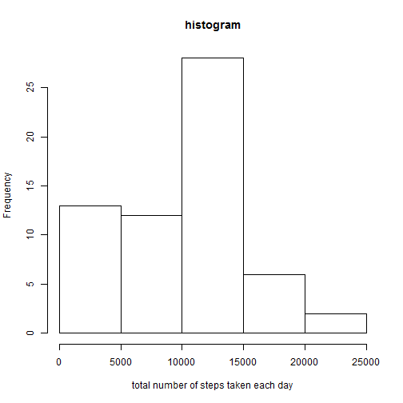
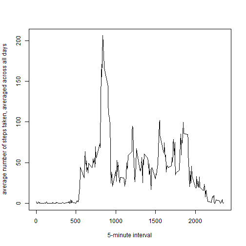
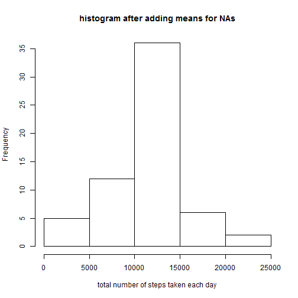

## Loading and preprocessing the data
<!-- rmarkdown v1 -->

```r
knitr::opts_chunk$set(cache=FALSE)
library(dplyr)
```

```
## 
## Attaching package: 'dplyr'
## 
## The following object is masked from 'package:stats':
## 
##     filter
## 
## The following objects are masked from 'package:base':
## 
##     intersect, setdiff, setequal, union
```

```r
rawdata<- read.csv("activity.csv", stringsAsFactors = FALSE)
rawdata$date<- as.POSIXct(rawdata$date, format = "%Y-%m-%d")
```


## What is mean total number of steps taken per day?

1. The total number of steps taken per day is:

```r
#get the sum of all the steps per day
sums<- data.frame(rawdata %>% group_by(date) %>% summarise(sum(steps,na.rm = TRUE)))
print(sums, type = "html")
```

```
##          date sum.steps..na.rm...TRUE.
## 1  2012-10-01                        0
## 2  2012-10-02                      126
## 3  2012-10-03                    11352
## 4  2012-10-04                    12116
## 5  2012-10-05                    13294
## 6  2012-10-06                    15420
## 7  2012-10-07                    11015
## 8  2012-10-08                        0
## 9  2012-10-09                    12811
## 10 2012-10-10                     9900
## 11 2012-10-11                    10304
## 12 2012-10-12                    17382
## 13 2012-10-13                    12426
## 14 2012-10-14                    15098
## 15 2012-10-15                    10139
## 16 2012-10-16                    15084
## 17 2012-10-17                    13452
## 18 2012-10-18                    10056
## 19 2012-10-19                    11829
## 20 2012-10-20                    10395
## 21 2012-10-21                     8821
## 22 2012-10-22                    13460
## 23 2012-10-23                     8918
## 24 2012-10-24                     8355
## 25 2012-10-25                     2492
## 26 2012-10-26                     6778
## 27 2012-10-27                    10119
## 28 2012-10-28                    11458
## 29 2012-10-29                     5018
## 30 2012-10-30                     9819
## 31 2012-10-31                    15414
## 32 2012-11-01                        0
## 33 2012-11-02                    10600
## 34 2012-11-03                    10571
## 35 2012-11-04                        0
## 36 2012-11-05                    10439
## 37 2012-11-06                     8334
## 38 2012-11-07                    12883
## 39 2012-11-08                     3219
## 40 2012-11-09                        0
## 41 2012-11-10                        0
## 42 2012-11-11                    12608
## 43 2012-11-12                    10765
## 44 2012-11-13                     7336
## 45 2012-11-14                        0
## 46 2012-11-15                       41
## 47 2012-11-16                     5441
## 48 2012-11-17                    14339
## 49 2012-11-18                    15110
## 50 2012-11-19                     8841
## 51 2012-11-20                     4472
## 52 2012-11-21                    12787
## 53 2012-11-22                    20427
## 54 2012-11-23                    21194
## 55 2012-11-24                    14478
## 56 2012-11-25                    11834
## 57 2012-11-26                    11162
## 58 2012-11-27                    13646
## 59 2012-11-28                    10183
## 60 2012-11-29                     7047
## 61 2012-11-30                        0
```
2. The historgram to show the total number of steps each day:

```r
hist(x = sums[,2], xlab = "total number of steps taken each day", main =  "histogram")
```

 

3. The mean and median are calculated as follows

```r
mean(sums[,2])
```

```
## [1] 9354.23
```

```r
median(sums[,2])
```

```
## [1] 10395
```


## What is the average daily activity pattern?
1. Make a time series plot of the 5-minute interval (x-axis) and the average number of steps taken, averaged across all days (y-axis)

```r
avginterval<- data.frame(rawdata %>% group_by(interval) %>% summarise(mean(steps,na.rm = TRUE)))
plot(x = avginterval$interval, y = avginterval$mean.steps..na.rm...TRUE.,xlab = "5-minute interval",ylab = "average number of steps taken, averaged across all days",type = "l")
```

 

2. Which 5-minute interval, on average across all the days in the dataset, contains the maximum number of steps?

```r
avginterval$interval[which.max(avginterval[,2])]
```

```
## [1] 835
```

## Imputing missing values

1. Calculate and report the total number of missing values in the dataset (i.e. the total number of rows with NAs)


```r
sum(!complete.cases(rawdata))
```

```
## [1] 2304
```
2. Devise a strategy for filling in all of the missing values in the dataset. The strategy does not need to be sophisticated. For example, you could use the mean/median for that day, or the mean for that 5-minute interval, etc.  

The strategy is to insert the mean that was calculated before for intervals into the NAs by interval.
This is done by first merging the means with the raw data
then by replacing each na value for steps by the value in the new column (the mean)

```r
imputeData<- merge(rawdata,avginterval, by = "interval")
imputeData[is.na(imputeData$steps),2]<-imputeData[is.na(imputeData$steps),4]
```

3. Create a new dataset that is equal to the original dataset but with the missing data filled in  

This is the above imputed dataset without the new column for the means. The dataset is sorted like the original by date then by interval. The dataset is called "sorted"

```r
sorted<- imputeData %>% arrange(date, interval)
sorted$mean.steps..na.rm...TRUE.<- NULL
head(sorted)
```

```
##   interval     steps       date
## 1        0 1.7169811 2012-10-01
## 2        5 0.3396226 2012-10-01
## 3       10 0.1320755 2012-10-01
## 4       15 0.1509434 2012-10-01
## 5       20 0.0754717 2012-10-01
## 6       25 2.0943396 2012-10-01
```

4. Make a histogram of the total number of steps taken each day and Calculate and report the mean and median total number of steps taken per day. Do these values differ from the estimates from the first part of the assignment? What is the impact of imputing missing data on the estimates of the total daily number of steps?


```r
sums2<- data.frame(sorted %>% group_by(date) %>% summarise(sum(steps,na.rm = TRUE)))
hist(x = sums2[,2], xlab = "total number of steps taken each day", main =  "histogram after adding means for NAs")
```

 

```r
mean(sums2[,2])
```

```
## [1] 10766.19
```

```r
median(sums2[,2])
```

```
## [1] 10766.19
```

## Are there differences in activity patterns between weekdays and weekends?

1. Create a new factor variable in the dataset with two levels – “weekday” and “weekend” indicating whether a given date is a weekday or weekend day.


```r
weekday<- sorted %>% mutate(day = weekdays(date))
weekday<- weekday %>% mutate(day = ifelse(day == "Saturday" | day =="Sunday",yes = "weekend", no = "weekday"))
```

2. Make a panel plot containing a time series plot (i.e. type = "l") of the 5-minute interval (x-axis) and the average number of steps taken, averaged across all weekday days or weekend days (y-axis). See the README file in the GitHub repository to see an example of what this plot should look like using simulated data.


```r
library(lattice)
avginterval2<- data.frame(weekday %>% group_by(interval, day) %>% summarise(mean(steps)))
xyplot(mean.steps. ~ interval|day, data = avginterval2, type = "l", layout = c(1,2), xlab = "interval", ylab = "number of steps")
```

 
